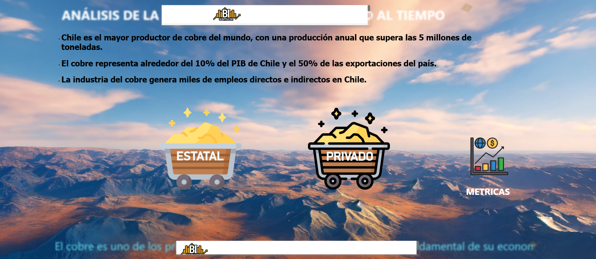

  

## 🚀 Live Dashboard

👉 **[Click here to explore the interactive dashboard](https://app.powerbi.com/view?r=eyJrIjoiODIzZTA4M2ItN2ZhOC00MDE3LWJmM2MtNDIyN2I5NWQ0ZTMzIiwidCI6IjFmNWE5OTE0LWE3MWUtNDRkNi1hMzllLTUyODdhYTcyMjkyZiIsImMiOjR9&pageName=ReportSectionb47d8d180a46264698c0)**

# 🟠 Copper Industry Analysis | Chile

## 📊 Tools & Skills

Power BI • Data Analysis • Business Intelligence • Economic Analysis • Data Visualization

---

## 📌 Project Overview

This project analyzes Chile's copper industry, the largest in the world, to understand production, economic impact, and differences between public and private sectors.

---

## 🌍 Context

Chile is the world's largest copper producer, with over 5 million tons annually.

* Copper represents ~10% of Chile’s GDP
* Accounts for ~50% of exports
* Generates thousands of jobs

---

## 🎯 Business Problem

Understanding the structure of the copper industry is critical for:

* Government decision-making
* Investment strategies
* Market analysis

---

## 📈 Key Insights

* Strong dominance of private sector production
* Significant economic dependence on copper exports
* Clear differences between public and private performance

---

## ⚙️ Data Process

* Data collection and cleaning
* Exploratory analysis
* KPI definition
* Dashboard development in Power BI

---

## 🛠️ Tools Used

* Power BI
* Data Visualization
* Economic Analysis

---

## 🚀 Outcome

This dashboard provides a clear overview of Chile’s copper industry, helping stakeholders understand key metrics and trends.

---

## 💡 Business Value

This project helps:

* Understand Chile’s economic structure
* Analyze mining sector performance
* Support investment and policy decisions
